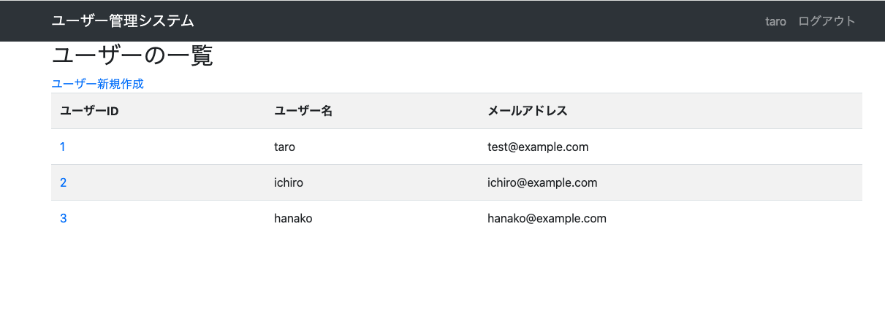
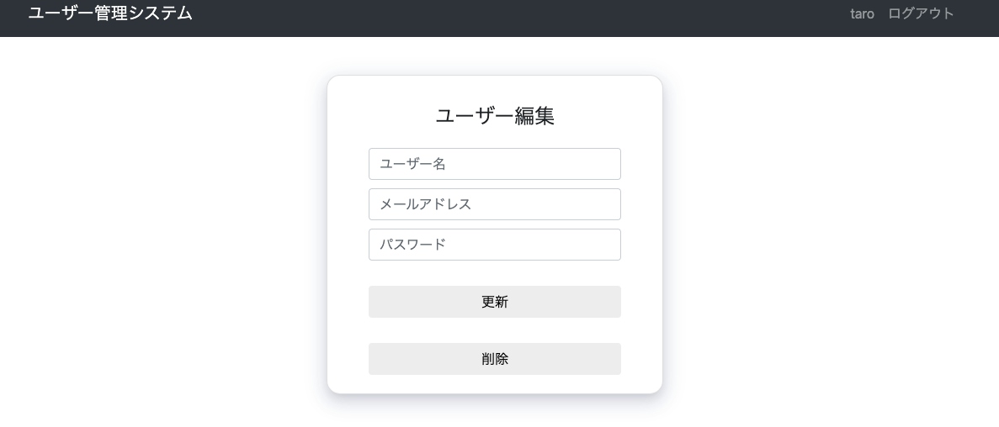
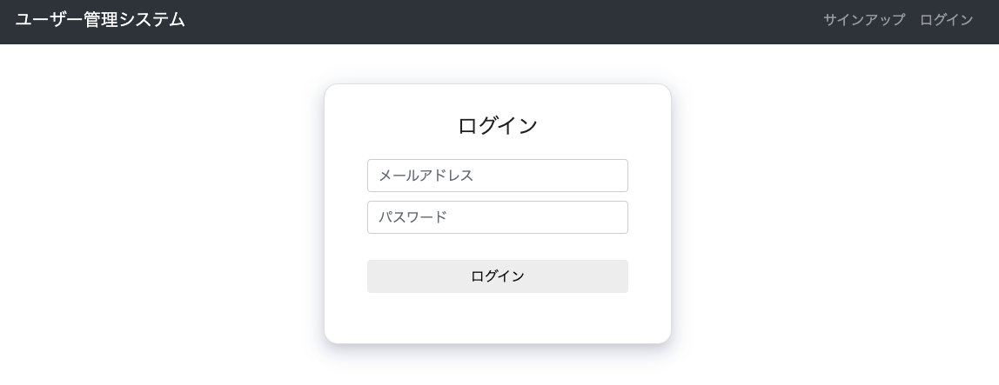

# Flaskを用いた簡易的なユーザー管理システムの構築

## 目標
FlaskとSQLiteを用いて簡易的なユーザー管理システムを構築する。  
以下、完成画面イメージ図。 
* ユーザー一覧画面
  

* ユーザー情報編集画面
  

* ログイン画面
  

## リポジトリの構成
* `app.py`
    * Flaskアプリケーションの構成やロギングに関する設定を管理
* `config.py`
    * 環境に応じた設定情報を管理
* `apps/crud`
    * ユーザー情報を管理するモデルの構築やユーザー一覧画面に関する資材を管理
* `apps/auth`
    * ログイン機能/サインアップ機能に関する資材を管理
* `apps/static/css`  
    * 各画面のスタイリングに関する資材を管理
